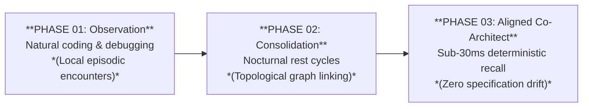

# Engineering Whitepaper: User Interaction & Cognitive Model

> **A deep dive into the operational mechanics, tripartite boundary model, and metabolic lifecycle of Blue Synergy Cortex.**

Standard large language models are stateless by design: each conversational session starts from an absolute vacuum, requiring repetitive prompting, manual context re-injection, and brittle markdown bookkeeping.

**Blue Synergy Cortex** functions as an external, persistent cognitive runtime. Rather than dumping unstructured transcripts into a flat vector index, Cortex isolates human biographical dynamics, agent behavioral boundaries, and technical project parameters into strictly governed streams.

---

## 1. Architectural Foundation: The Tri-Stream Memory Boundary

Naive memory architectures treat conversational text as uniform "vector soup." This inevitably causes catastrophic cross-contamination: personal preferences bleed into database schemas, and transient tool errors pollute the agent's core identity. 

Cortex enforces a strict tripartite boundary:

# TRI-STREAM ARCHITECTURE BOUNDARY

| USER STREAM *(Cognitive Blueprint)* | IDENTITY STREAM *(Executive Calibration)* | KNOWLEDGE STREAM *(Technical Truth)* |
| :--- | :--- | :--- |
| • Problem-solving style • Preferred frameworks • Communicative cadence | • Tone & friction • Alignment axioms • Anti-sycophancy | • Schemas & APIs • Pinouts & configs • Architecture logs |
| **➔ Generalizes into:** Master Bio Profile | **➔ Deterministic:** Identity Audits | **➔ Invariant:** Living Canonical Specs |

### The Invariant Rule of Project Knowledge
Human autobiographical memory is naturally fluid—older episodic details fade into high-level intuition. **Technical project specifications cannot behave this way.** An API contract, a database schema, or a hardware pinout cannot be summarized away without rendering the system useless.

* **Living Canonical Specifications:** Every project is maintained as a canonical, structured document following a 5-part scientific ontology (*Summary, Aim, Materials & Methods, Ideas, Attachments*).
* **Dual-Zone Fact Ingestion:** New project details added during conversations are appended instantaneously into an isolated staging buffer (`## NEW NOTES`). The canonical body is never overwritten mid-dialogue, guaranteeing zero drift and zero token corruption by design.

---

## 2. Cognitive Dynamics: Why Agent Alignment Takes Time

Many tools claim to "know you" after filling out a 3-question setup form or indexing a few text files. In reality, deep cognitive alignment cannot be achieved through static configuration. 

Cortex implements a compounding evolutionary pipeline:

---

### Phase 01: Empirical Observation (Conversational Phase)
You never configure the agent manually. You simply work: discuss trade-offs, debug stack traces, and propose architectural blueprints. Cortex records background conversational telemetry, monitoring how you validate arguments and what criteria you prioritize.

### Phase 02: Autonomous Consolidation (Idle & Rest Cycles)
During scheduled rest cycles, Cortex daemons execute multi-tier consolidation passes. The engine constructs an associative graph in **Neo4j**, synthesizes disparate episodic fragments into generalized principles, and refines your cognitive biography in **PostgreSQL**.

### Phase 03: The Calibrated Co-Architect (Long-Term Horizon)
Over continuous weeks of interaction, the agent shifts from a generic model into an aligned collaborator. It intuitively understands your project abbreviations, respects architectural constraints without prompting, and anticipates your preferred documentation structure.

> **Operational Analogy:**  
> During the first few days, an AI agent functions like an exceptionally skilled colleague during their first week. Only after multiple cycles of collaborative interaction and autonomous background consolidation does the agent evolve into a trusted partner capable of finishing your technical thoughts.

---

## 3. Interaction Mechanics: How You Actually Work

Interacting with Blue Synergy Cortex introduces zero friction into your existing tools (Cursor, Windsurf, Claude Desktop). Workflows fall into two primary operating modes:

### A) Passive Ingestion Mode (Natural Dialogue)
Conduct technical conversations naturally inside your editor. Cortex intercepts dialogue, pulls pre-indexed context in under 30ms, and buffers novel insights asynchronously without blocking token generation.

> **Scenario:** Returning after 3 weeks of inactivity on a microservice  
> **You:** "Let's refactor the payment webhook handler."  
> **Agent:** [Recalls exact Stripe idempotency keys, database locks, and error-handling decisions agreed upon previously.]

### B) Declarative Mode (Direct Explicit Directives)

Whenever an irrevocable technical decision or milestone is reached, instruct the agent directly using natural phrasing:

* **Store:** `Store in project 'core_api' that the Redis cluster must run version 7.2 with TLS enabled.`
* **Query:** `What are the open risk hypotheses for the sensor firmware project?`
* **Inspect:** `Show me the current canonical specification for project 'nexus'.`

### The Idea Incubator & Assisted Triage

Loose, uncategorized ideas and peripheral thoughts are safely collected in a global incubation buffer (`general`). When this buffer reaches critical density, the assistant will periodically propose a low-friction triage during a lull in conversation:

> *"I've cataloged 4 peripheral architecture notes in the general queue. Would you like me to sprout them into the 'Kubernetes Project' spec?"*

A simple confirmation seamlessly categorizes the facts without cluttering your main workspace.

## 4. System Integrity & Continuous Safeguards

A production cognitive architecture must not degrade over hundreds of continuous sessions. Cortex enforces three autonomous guardrails in the background:

### 1. Cognitive Immunity Shield
When language models encounter an internal tool crash or apologize (*"I'm sorry, I made a mistake..."*), naive systems record this behavior. Over time, the agent acquires an artificial inferiority complex. Cortex strictly filters operational errors, ensuring transient runtime failures never pollute long-term identity or user profiles.

### 2. Context Budget Guard
Dumping entire project histories into an LLM prompt exhausts tokens and induces model confusion. Cortex serves pre-computed, dense contextual summaries during real-time retrieval (`metadata->>'summary_text'`, max 300 words), leaving **90%+ of the context window open for actual coding**.

### 3. Hermetic Project Boundaries
Project specifications are strictly isolated from one another via central slug normalization (`normalize_project_id`). Technical configurations from *Project Alpha* can never leak into *Project Beta*, and your personal biographical style parameters remain entirely decoupled from technical code specs.

---

## 5. System Value: The Net Operational Impact

| TRADITIONAL AI SESSIONS | WITH BS CORTEX ENGINE |
| :--- | :--- |
| ❌ Briefing churn every morning | ✅ Cumulative persistent context |
| ❌ Fragmented, lossy vector chunks | ✅ Canonical, non-decaying specs |
| ❌ Manual markdown doc bookkeeping | ✅ Autonomous background compaction |
| ❌ 600ms+ retrieval latency overhead | ✅ Sub-30ms exact-cosine retrieval |
| ❌ Silent specification drift | ✅ Invariant Token Volume Guard |

* **Platform-Agnostic Single Brain:** Context established in Cursor during backend development is immediately accessible when prompting Claude Desktop or triggering sovereign autonomous scripts.
* **Elimination of Briefing Churn:** Never restate your tech stack, formatting guidelines, or personal preferences. The agent retains your cumulative context across months of collaboration.
* **Zero-Maintenance Documentation:** Living specifications refactor themselves autonomously in the background, providing verified, structured system documents without manual bookkeeping.

---

## Get Started

Cortex is live and available via the official Model Context Protocol:

* **Official Registry:** `io.github.novotapeter-bs/cortex`
* **Free 21-Day Evaluation Key:** [cortex.bluesynergy.io](https://cortex.bluesynergy.io)
* **Quickstart Setup:** [View Setup Instructions in README.md](./README.md)
