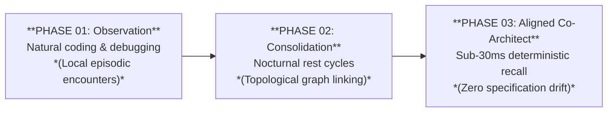

# Engineering Whitepaper: User Interaction & Cognitive Model 🧠

> **A deep dive into the operational mechanics, tripartite boundary model, and metabolic lifecycle of Blue Synergy Cortex.**

Standard large language models are stateless by design: each conversational session starts from an absolute vacuum, requiring repetitive prompting, manual context re-injection, and brittle markdown bookkeeping.

**Blue Synergy Cortex** functions as an external, persistent cognitive runtime. Rather than dumping unstructured transcripts into a flat vector index, Cortex isolates human biographical dynamics, agent behavioral boundaries, and technical project parameters into strictly governed streams.

---

## 1. Architectural Foundation: The Tri-Stream Memory Boundary

Naive memory architectures treat conversational text as uniform "vector soup." This inevitably causes catastrophic cross-contamination: personal preferences bleed into database schemas, and transient tool errors pollute the agent's core identity. 

Cortex enforces a strict tripartite boundary:


# TRI-STREAM ARCHITECTURE BOUNDARY

| USER STREAM<br>*(Cognitive Blueprint)* | IDENTITY STREAM<br>*(Executive Calibration)* | KNOWLEDGE STREAM<br>*(Technical Truth)* |
| :--- | :--- | :--- |
| • Problem-solving style<br>• Preferred frameworks<br>• Communicative cadence | • Tone & friction<br>• Alignment axioms<br>• Anti-sycophancy | • Schemas & APIs<br>• Pinouts & configs<br>• Architecture logs |
| **➔ Generalizes into:**<br>Master Bio Profile | **➔ Deterministic:**<br>Identity Audits | **➔ Invariant:**<br>Living Canonical Specs |


### The Invariant Rule of Project Knowledge
Human autobiographical memory is naturally fluid—older episodic details fade into high-level intuition. **Technical project specifications cannot behave this way.** An API contract, a database schema, or a hardware pinout cannot be summarized away without rendering the system useless.

* **Living Canonical Specifications:** Every project is maintained as a canonical, structured document following a 5-part scientific ontology (*Summary, Aim, Materials & Methods, Ideas, Attachments*).
* **Dual-Zone Fact Ingestion:** New project details added during conversations are appended instantaneously into an isolated staging buffer (`## 📥 NEW NOTES`). The canonical body is never overwritten mid-dialogue, guaranteeing zero drift and zero token corruption by design.

---

## 2. Cognitive Dynamics: Why Agent Alignment Takes Time

Many tools claim to "know you" after filling out a 3-question setup form or indexing a few text files. In reality, deep cognitive alignment cannot be achieved through static configuration. 

Cortex implements a compounding evolutionary pipeline:

---

### Varianta B: Markdown tabulka

```markdown
| PHASE 01: Observation | ➔ | PHASE 02: Consolidation | ➔ | PHASE 03: Aligned Co-Architect |
| :--- | :---: | :--- | :---: | :--- |
| **Natural coding & debugging**<br>*(Local episodic encounters)* | | **Nocturnal rest cycles**<br>*(Topological graph linking)* | | **Sub-30ms deterministic recall**<br>*(Zero specification drift)* |



